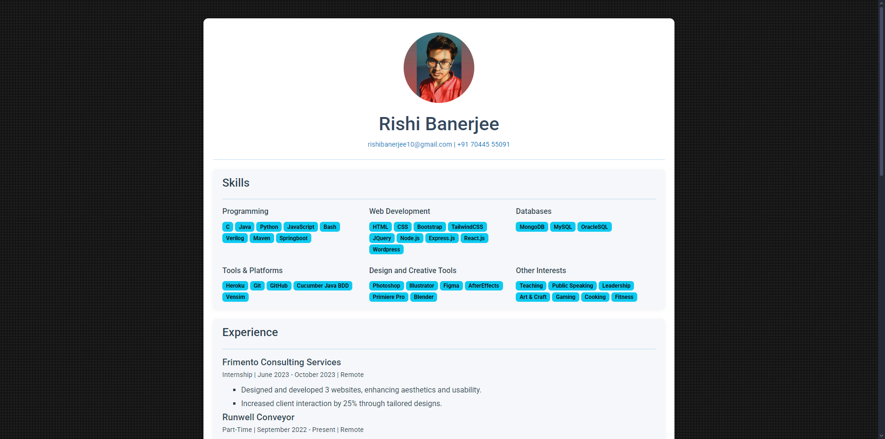

# Rishi Banerjee | Online Resume

Welcome to the **Online Resume** repository! This project is a simple, stylish online resume website designed to showcase my resume in a modern looking website perspective. It's built with HTML and CSS, ensuring a clean, modern, and user-friendly experience.

## Website Status & URL

 
View the live website at [https://rishi-banerjee-resume.netlify.app](https://rishi-banerjee-resume.netlify.app).

## What it contains

- **Skills**: Shows my various technical and non-technical skills.
- **Experiences**: Shows my various experiences and my contributions.
- **Projects**: Shows some of my coding projects.
- **Education**: Shows my grade points earned in school and college.
- **Social Links**: Links to all my social profiles.

## Is it upto date?
Yes, my resume is upto date as of 01/01/2025. In future I might need to edit it more to add more of my works.

<h2>Tools used</h2>
<ol>
  <li>Visual Studio Code</li>
  <li>HTML</li>
  <li>CSS</li>
  <li>Netlify</li>
</ol>

<h2>Link to Tools</h2>

  &emsp;
  &emsp;
  &emsp;
  &emsp;

<h2>Developer</h2>
<ul>
  <li><a href="https://github.com/QwertyFusion">[@QwertyFusion]</a></li>
</ul>
